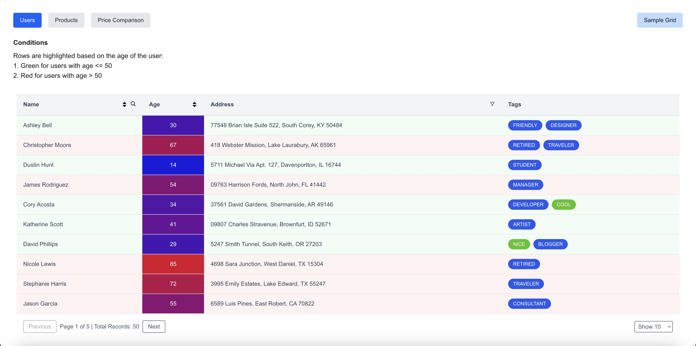
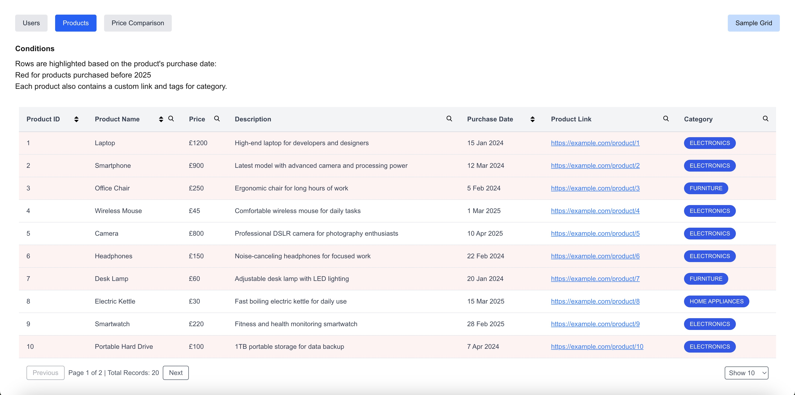
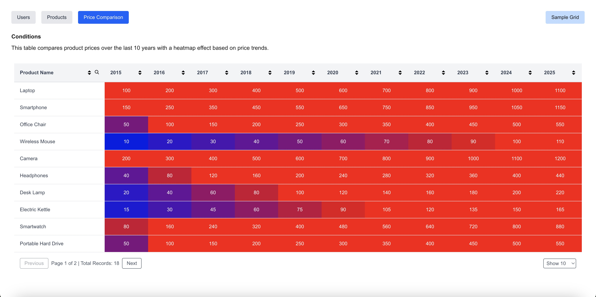

This is a [Next.js](https://nextjs.org) project bootstrapped with [`create-next-app`](https://nextjs.org/docs/app/api-reference/cli/create-next-app).

## Prerequisites

Make sure you have [Node.js](https://nodejs.org/en) installed on your machine.

## Getting Started

First, install node modules:

```bash
npm install
# or
npm i
```

Now, run the development server:

```bash
npm run dev
# or
yarn dev
# or
pnpm dev
# or
bun dev
```

Open [http://localhost:3000](http://localhost:3000) with your browser to see the result.

You can start editing the page by modifying `app/page.tsx`. The page auto-updates as you edit the file.

This project uses [`next/font`](https://nextjs.org/docs/app/building-your-application/optimizing/fonts) to automatically optimize and load [Geist](https://vercel.com/font), a new font family for Vercel.


## Testing

This project uses [Jest](https://jestjs.io/) along with [React Testing Library](https://testing-library.com/docs/react-testing-library/intro/) for unit and integration testing.

To run the test suite:

bash
```
npm run test
```

Test files are located inside the __test__/ directory.

## Project Structure
```
__test__/                 # Contains test files
src/components/           # Generic reusable components
  └── DataGrid.tsx        # DataGrid component
app/[resources]/          # Dynamic routes based on resource type (e.g. users, products, price_comparison)
                          # Each page fetches table config from backend based on the resource value
app/data-grid/            # Visualized dummy table showcasing frontend-only column/row config
app/utils/                # Utilities for table column rendering and row styling
```


## Learn More

To learn more about Next.js, take a look at the following resources:

- [Next.js Documentation](https://nextjs.org/docs) - learn about Next.js features and API.
- [Learn Next.js](https://nextjs.org/learn) - an interactive Next.js tutorial.

You can check out [the Next.js GitHub repository](https://github.com/vercel/next.js) - your feedback and contributions are welcome!

## Deploy on Vercel

The easiest way to deploy your Next.js app is to use the [Vercel Platform](https://vercel.com/new?utm_medium=default-template&filter=next.js&utm_source=create-next-app&utm_campaign=create-next-app-readme) from the creators of Next.js.

Check out our [Next.js deployment documentation](https://nextjs.org/docs/app/building-your-application/deploying) for more details.


## Screenshot

Here’s a screenshot of the application:





